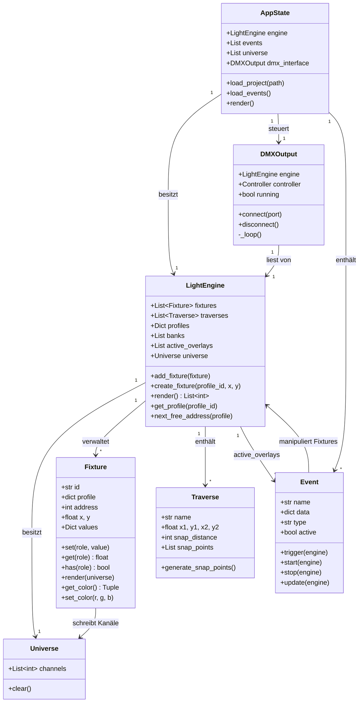
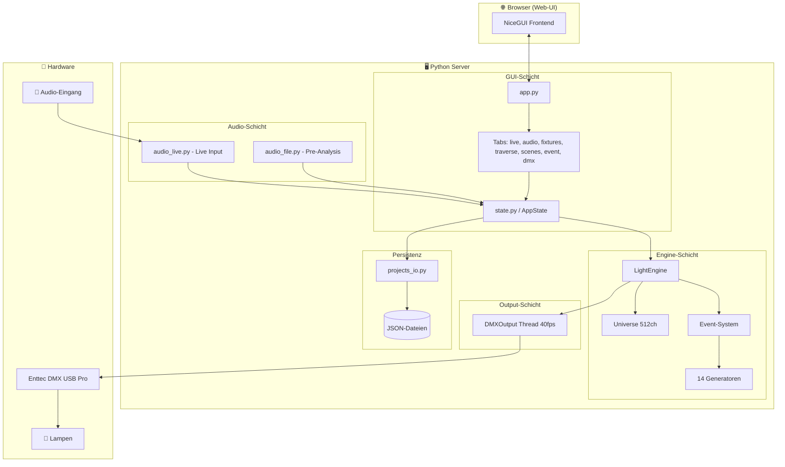
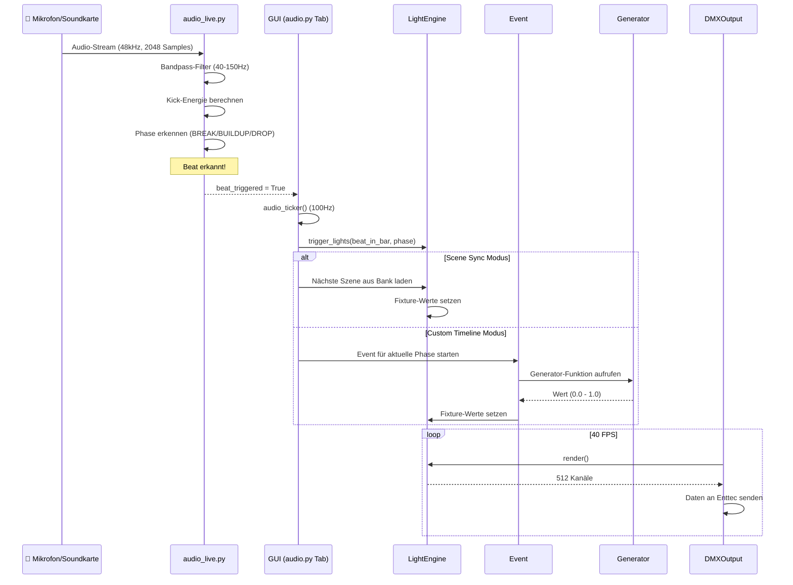

# Light2Wave

**Soundbasierte Lichtsteuerung für Veranstaltungen**

Light2Wave ist eine in Python entwickelte Software zur Echtzeit-Steuerung von Veranstaltungsbeleuchtung über das DMX-Protokoll. Die Anwendung analysiert Audiosignale – wahlweise als voranalysierte MP3/WAV-Datei oder als Live-Eingang – und steuert darauf basierend automatisch Lichteffekte, die synchron zur Musik ablaufen.

Die Software bietet ein Web-UI (NiceGUI), über das Benutzer Fixtures auf virtuellen Traversen platzieren, Lichtszenen programmieren, dynamische Effekte erstellen und eine vollautomatische Sound-to-Light-Show fahren können.

---

## Inhaltsverzeichnis

- [Features](#features)
- [Installation](#installation)
- [Ausführung](#ausführung)
- [Bedienungsanleitung](#bedienungsanleitung)
- [Softwarearchitektur](#softwarearchitektur)
- [UML-Diagramme](#uml-diagramme)
- [Umgesetzte Erweiterungen](#umgesetzte-erweiterungen)
- [Verwendete Technologien & Quellen](#verwendete-technologien--quellen)

---

## Features

- **Zwei Audio-Modi:** Pre-Analysis (MP3/WAV mit BPM- und Strukturerkennung) und Live-Input (Echtzeit-Beaterkennung über Soundkarte)
- **Automatische Phasenerkennung:** Erkennt BREAK, BUILDUP und DROP in der Musik
- **14 Lichtgeneratoren:** Von linearen Wellen über Plasma bis hin zu Strobo und Heartbeat
- **Visueller Traverse-Editor:** Drag-and-Drop-Platzierung von Fixtures auf Snap-Points
- **Szenen- und Banken-System:** Speichern und Abrufen von Lichtstimmungen mit Beat-Chasing
- **Event-Editor:** Erstellen und Bearbeiten von statischen, dynamischen und Flash-Events über die GUI
- **DMX-Output:** Echtzeit-Ausgabe über Enttec DMX USB Pro Interface (40 FPS)
- **Custom Fixture-Profile:** Eigene Geräteprofile über die GUI anlegen und speichern
- **Projekt-Persistenz:** Speichern/Laden von Fixtures, Traversen, Szenen und Banken als JSON
- **Live-Dashboard:** Echtzeit-Visualisierung der Lampenfarben auf der virtuellen Bühne

---

## Installation

### Voraussetzungen

- Python 3.10 oder höher
- pip (Python-Paketmanager)
- Optional: Enttec DMX USB Pro Interface für echte DMX-Ausgabe
- Optional: Audioeingang (USB-Soundkarte, DJ-Mixer o.ä.) für den Live-Modus

### Schritt-für-Schritt

1. **Repository klonen:**
   ```bash
   git clone https://github.com/lbenk06/light2wave.git
   cd light2wave
   ```

2. **Virtuelle Umgebung erstellen (empfohlen):**
   ```bash
   python -m venv venv

   # Windows:
   venv\Scripts\activate

   # macOS / Linux:
   source venv/bin/activate
   ```

3. **Abhängigkeiten installieren:**
   ```bash
   pip install -r requirements.txt
   ```

4. **Hinweis zu PyAudio (falls Installation fehlschlägt):**

   Unter Windows muss PyAudio ggf. manuell installiert werden:
   ```bash
   pip install pipwin
   pipwin install pyaudio
   ```
   Unter Linux:
   ```bash
   sudo apt-get install portaudio19-dev
   pip install pyaudio
   ```

---

## Ausführung

```bash
python main.py
```

Die Anwendung startet einen lokalen Webserver. Das Web-UI ist danach im Browser erreichbar unter:

```
http://localhost:8081
```

> **Hinweis:** Der Server bindet auf `0.0.0.0`, sodass auch andere Geräte im selben Netzwerk auf die Oberfläche zugreifen können (z.B. ein Tablet als Remote-Steuerung, um die Geräte über die Slider zu steuern).

---

## Bedienungsanleitung

Die Anwendung ist in mehrere Tabs unterteilt:

### Tab: Traverse
Hier wird das Bühnen-Setup konfiguriert. Traversen (Front, Links, Rechts) bilden die Grundstruktur. Fixtures werden aus einem Profil-Dropdown ausgewählt und per Klick auf Snap-Points der Traversen platziert. Geräte lassen sich per Drag-and-Drop verschieben oder in den Papierkorb ziehen.

### Tab: Geräte
Zeigt alle platzierten Fixtures mit Schiebereglern für jeden DMX-Kanal (Dimmer, R, G, B, W, Strobe etc.). Hier können Lichtstimmungen manuell eingestellt werden. Im unteren Bereich lassen sich eigene Geräteprofile definieren.

### Tab: Szenen
Im Programmiermodus werden **Banken** erstellt (z.B. „Warm", „Party", „Blau"). Innerhalb einer Bank werden **Szenen** gespeichert – jede Szene ist ein Snapshot aller aktuellen Fixture-Werte, welche zuvor über die Slider im Geräte-Tab eingestellt wurden. Im Live-Playback können Szenen per Klick abgefeuert werden.

### Tab: Events
Der Event-Editor erlaubt das Erstellen von Lichteffekten mit folgenden Typen:
- **static:** Setzt feste Werte, gleich wie eine Szene (z.B. alle Lampen rot)
- **dynamic:** Nutzt einen Generator für animierte Effekte (z.B. Welle, Plasma)
- **flash:** Einmaliger Blitz mit konfigurierbarem Attack/Decay
- **stop_all:** Blackout – stoppt alle laufenden Effekte

### Tab: Audio In
Hier wird die Audioquelle gewählt und die automatische Show-Steuerung konfiguriert:
- **MP3-Modus:** Datei laden → automatische Analyse (BPM, Beats, Songstruktur) → Play
- **Live-Modus:** Soundkarte auswählen → Echtzeit-Beaterkennung mit einstellbarer Sensitivität, dualem VU-Meter (Lautstärke + Beat-Confidence)

Auf der rechten Seite befindet sich die Show-Steuerung mit zwei Modi:
- **Scene Sync:** Szenen aus einer Bank werden automatisch im erkannten Takt gewechselt
- **Custom Timeline:** Den Phasen (BREAK/BUILDUP/DROP) werden individuell Banken oder Events zugewiesen (Mehrfachauswahl möglich)
- **Flash Automatik (Magic Mode):** Zuschaltbares Overlay, das bei Drops oder auf dem ersten Beat zufällig Blinder-Effekte auslöst


Möchte man aus dem Sound to Light Modus wieder in den Programmiermodus wechseln (Szenen Tab) bzw. wieder Effekte manuell im Live-Tab triggern ist es wichtig im Audio-Tab den Live MP3 Player zu stoppen oder beim Verwenden von Live Audio die Verbindung zum Input zu trennen.

### Tab: LIVE
Das Live-Dashboard zeigt ein Echtzeit-Bild der Bühne mit allen Traversen und Lampen – die Fixture-Farben aktualisieren sich live. Auf der rechten Seite können Szenen aus Banken per Klick abgefeuert, Effekte ein- und ausgeschaltet sowie Blinder-Buttons oben direkt getriggert werden. Ein großer STOP ALL-Button stoppt alles sofort (Blackout). Wenn man aus dem Live Modus wieder in den Programmiermodus (Szenen-Tab) wechselt, ist es wichtig davor den Stop-All Button zu drücken. Ist gerade bspw. die Sound to Light Automatik in Betrieb lassen sich trotzdem Blinder, Effekte und Szenen aus dem Live Tab abfeuern diese werden dann übereinander gelegt (overlay).

### Tab: DMX
Verbindung zum Enttec DMX USB Pro Interface herstellen/trennen. Ein Output-Monitor zeigt die DMX-Werte der ersten 32 DMX-Kanäle live an.

---

## Softwarearchitektur

### Projektstruktur

```
light2wave/
├── main.py                  # Einstiegspunkt: App, DMX-Output, Server
│
├── audio/
│   ├── audio_file.py        # Pre-Analysis: librosa BPM/Beat/Struktur-Erkennung
│   └── audio_live.py        # Live-Input: Echtzeit-Beaterkennung via sounddevice
│
├── engine/
│   ├── light_engine.py      # Zentrale Engine: Fixtures, Rendering, Profile
│   ├── universe.py          # DMX-Universe (512 Kanäle)
│   ├── events.py            # Event-System (static, dynamic, flash, stop_all)
│   ├── generators.py        # 14 Lichteffekt-Generatoren (Sinus, Plasma, etc.)
│   └── traverse_snap.py     # Traverse-Geometrie mit Snap-Points
│
├── fixtures/
│   ├── fixture.py           # Fixture-Klasse (Werte, Rendering, Farbberechnung)
│   └── profiles.py          # Standard-Geräteprofile (LED PAR, Fluter, Moving Head)
│
├── dmx/
│   └── output.py            # DMX-Ausgabe-Thread (Enttec Pro, 40 FPS)
│
├── gui/
│   ├── app.py               # NiceGUI App-Setup mit Tab-Struktur
│   ├── state.py             # Globaler AppState (Singleton)
│   └── tabs/
│       ├── live.py          # Live-Dashboard mit Bühnenvisualisierung
│       ├── audio.py         # Audio-Steuerung (MP3 + Live)
│       ├── fixtures.py      # Geräte-Slider und Profil-Editor
│       ├── traverse.py      # Visueller Traverse-Editor
│       ├── scenes.py        # Szenen-/Banken-Verwaltung
│       ├── event.py         # Event-Editor
│       └── dmx.py           # DMX-Hardware-Verbindung und Monitor
│
├── projects/
│   ├── projects_io.py       # Projekt laden/speichern (JSON)
│   └── user_profiles.json   # Benutzerdefinierte Fixture-Profile
│
├── data/
│   └── events_default.json  # Gespeicherte Events
│
├── requirements.txt
└── README.md
```

### Architekturprinzip

Die Anwendung folgt einem **schichtbasierten Architekturmuster**:

1. **Engine-Schicht** (`engine/`): Enthält die gesamte Geschäftslogik – das DMX-Universe, die Fixture-Verwaltung, das Event-System und die Effektgeneratoren. Diese Schicht ist vollständig unabhängig von der GUI.

2. **Audio-Schicht** (`audio/`): Verantwortlich für die Signalverarbeitung. Läuft in eigenen Threads, um die GUI nicht zu blockieren. Kommuniziert über globale State-Dictionaries.

3. **GUI-Schicht** (`gui/`): Baut auf NiceGUI auf und stellt die Benutzeroberfläche als Web-App bereit. Greift lesend und schreibend auf die Engine zu.

4. **Output-Schicht** (`dmx/`): Ein Daemon-Thread, der in einer Endlosschleife (40 FPS) die gerenderten DMX-Daten aus der Engine an das physische Interface sendet.

5. **Persistenz-Schicht** (`projects/`): Serialisiert den Engine-Zustand (Fixtures, Traversen, Szenen, Banken) als JSON.

---

## UML-Diagramme

### Klassendiagramm



### Komponentendiagramm



### Sequenzdiagramm – Sound-to-Light (Live-Modus)



---

## Umgesetzte Erweiterungen

Über die Grundanforderungen (Python mit OOP, Git/GitHub, Web-UI) hinaus wurden folgende Erweiterungen implementiert:

### 1. Echtzeit-Audioanalyse mit zwei Modi
- **Pre-Analysis (MP3/WAV):** Vollständige Voranalyse mittels librosa – BPM-Erkennung, Beat-Tracking und automatische Strukturerkennung (BREAK/BUILDUP/DROP) basierend auf RMS-Energie und Trendberechnung.
- **Live-Input:** Echtzeit-Beaterkennung über sounddevice mit Butterworth-Bandpassfilter (40–150 Hz) für die Kick-Drum-Isolation, adaptiver Schwellenwert und Live-Phasenerkennung über kurz-/langfristige Energieverhältnisse.

### 2. Generator-basiertes Effektsystem
14 mathematische Generatorfunktionen erzeugen ortsabhängige Lichteffekte basierend auf den X/Y-Koordinaten der Fixtures:
- Wellen (linear, vertikal, symmetrisch), Radar, Scanner, Plasma
- Strobo, Sparkle, Flicker, Breathing, Heartbeat
- Flash-Decay mit konfigurierbarem Attack/Decay
- Hard Chase, Gate Pulse (von Traverse-Mitte ausgehend)

### 3. Visueller Traverse-Editor mit Snap-System
Fixtures werden nicht frei platziert, sondern auf mathematisch berechneten Snap-Points entlang der Traversen eingerastet. Die Snap-Points werden automatisch in zwei Reihen (beidseitig der Traverse) generiert. Drag-and-Drop-Verschiebung zwischen Snap-Points und Lösch-Funktion via Mülleimer.

### 4. DMX-Hardware-Integration
Paralleler Daemon-Thread sendet mit 40 FPS gerenderte DMX-Daten über ein Enttec DMX USB Pro Interface. Die Verbindung kann zur Laufzeit hergestellt und getrennt werden.

### 5. Szenen-/Banken-System mit Beat-Chasing
Szenen speichern den kompletten Zustand aller Fixtures. Im Scene-Sync-Modus werden Szenen automatisch im erkannten Takt durchgewechselt. Im Custom-Timeline-Modus können den Phasen (BREAK/BUILDUP/DROP) individuell Banken oder Events zugewiesen werden.

### 6. Custom Fixture-Profile
Über die GUI können eigene Geräteprofile (Kanalanzahl und -belegung) definiert und persistent gespeichert werden, sodass beliebige DMX-Geräte eingebunden werden können.

### 7. Flash-Automatik (Magic Mode)
Ein zuschaltbares Overlay, das bei erkannten Drops oder auf dem ersten Beat eines Taktes zufällig Flash-Events auslöst – für zusätzliche visuelle Dynamik ohne manuelles Eingreifen.

---

## Verwendete Technologien & Quellen

### Frameworks und Bibliotheken

| Bibliothek | Verwendung | Quelle |
|---|---|---|
| **NiceGUI** | Web-UI Framework (basierend auf FastAPI, Vue.js, Quasar) | [nicegui.io](https://nicegui.io/) |
| **librosa** | Audio-Analyse: BPM, Beat-Tracking, RMS-Energie | [librosa.org](https://librosa.org/) |
| **sounddevice** | Echtzeit-Audio-Streaming von Soundkarten | [python-sounddevice.readthedocs.io](https://python-sounddevice.readthedocs.io/) |
| **pygame** | Audio-Wiedergabe (MP3/WAV Playback) | [pygame.org](https://www.pygame.org/) |
| **scipy** | Signalverarbeitung (Butterworth-Bandpassfilter) | [scipy.org](https://scipy.org/) |
| **numpy** | Numerische Berechnungen, Array-Operationen | [numpy.org](https://numpy.org/) |
| **DMXEnttecPro** | Steuerung des Enttec DMX USB Pro Interface | [PyPI](https://pypi.org/project/DMXEnttecPro/) |
| **pyserial** | Serielle Kommunikation (COM-Port-Erkennung) | [pyserial.readthedocs.io](https://pyserial.readthedocs.io/) |

### Fachliche Quellen und Konzepte

- **Beat-Tracking-Algorithmus:** Basiert auf librosas `beat.beat_track()`, welches den Onset-Strength-Envelope und Dynamic Programming nutzt. Vgl. Ellis, D.P.W. (2007): *Beat Tracking by Dynamic Programming*, Journal of New Music Research.
- **Kick-Drum-Erkennung:** Bandpass-Filterung im Bereich 40–150 Hz zur Isolation des Bass-/Kick-Frequenzbereichs mit adaptivem Schwellenwert über ein gleitendes Energiefenster.
- **Strukturerkennung (BREAK/BUILDUP/DROP):** Eigenentwicklung basierend auf RMS-Energie-Verhältnissen: geglättete Energie wird mit dem Gesamtdurchschnitt verglichen, ergänzt durch Trendanalyse (Energiedifferenz über Zeit).
- **DMX512-Protokoll:** Industriestandard für die digitale Steuerung von Bühnenbeleuchtung. Jeder Kanal überträgt Werte von 0–255. Vgl. ANSI E1.11 – 2008 (USITT DMX512-A).
- **Generatorfunktionen:** Mathematische Effekte basierend auf trigonometrischen Funktionen (Sinus-Wellen mit Phasenverschiebung nach Fixture-Position), Exponentialfunktionen (Flash-Decay) und Pseudo-Rauschen (Sparkle/Flicker).

---

## Autoren

- [lbenk06](https://github.com/lbenk06)
- [kleethom](https://github.com/kleethom)

---

## Lizenz

Dieses Projekt wurde im Rahmen eines Hochschul-Softwareprojekts erstellt.